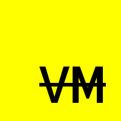

# **NVM**

**[Контрибьютинг](CONTRIBUTING.ru.md) | [Roadmap](ROADMAP.ru.md) | [Архитектура](docs/Architecture/Architecture.ru.md) | [NB формат](docs/File-Format/File-Format.ru.md) | [CoC](CODE_OF_CONDUCT.ru.md) | [Лицензия](LICENSE)**

**NVM** (**N**ot **V**irtual **M**achine) — это виртуальная машина с 64-битными регистрами.

## Состояние проекта
Pre-Alpha. Нету I/O ещё даже.
