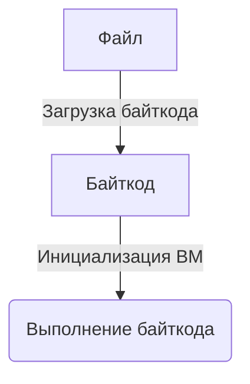

# Архитектура NVM
Этот документ описывает архитектуру NVM.

## Содержание
- [Определения](#определения)
- [Поподробнее про NVM](#поподробнее-про-nvm)
- [Pipeline](#pipeline)
    - [Байткод](#байткод)
    - [Выделение памяти](#выделение-памяти)
    - [Выполнение байткода](#выполнение-байткода)
- [Что где находится](#что-где-находится)

## Определения
- **"Опкод"** — это код операции инструкции, который определяет тип инструкции. Опкод представлен в виде одного байта.
- **"Операнд"** — это аргумент инструкции, который может быть регистром или immediate значением.
- **"Инструкция"** — это команда, которая выполняет определённую операцию. Каждая инструкция имеет опкод, который определяет её
    тип, и может иметь операнды, которые задают аргументы для этой операции.
- **"Байткод"** — последовательность инструкций, представленных в виде байтов. 

---

## Поподробнее про NVM
В NVM 255 64-битных регистров. Одна инструкция содержит в себе:
- 1 опкод;
- 3 операнда (опциональных).

Есть 2 вида операнда:
- Регистр (1 байт);
- Immediate-число (8 байт).

## Pipeline

Разберём каждый этап:

### Байткод
Сначала NVM загружает байткод из файла с форматом NVM Bytecode (см. [документацию](../File-Format/FILE-FORMAT.ru.md)).
Загрузчик проверяет:
- заголовок файла;
- может ли NVM выполнить байткод (поддерживается ли версия).

После заголовка, загрузчик начинает читать инструкции.

Читает инструкции он следующим образом:
1. Читает опкод инструкции (1 байт).
2. Определяет количество операндов, которые идут после опкода (1 байт).
3. Узнаёт сколько байт занимает следующий операнд (1 байт) по тегу (0x00 — регистр, 1 байт; 0x01 — immediate значение, 8 байт).
4. Читает операнд.

3-ий и 4-ый шаг повторяются для каждого операнда инструкции.

На выходе получается `Vec<Instruction>`.

---

### Выделение памяти
После того как байткод загружен, NVM выделяет память (если не передался размер памяти — 64КБ) для выполнения программы.
Сама память — просто последовательность байт, которую можно интерпретировать как угодно.

#### Зачем нужна память
Память нужна, когда не хватает регистров для хранения данных.

---

### Выполнение байткода
После загрузки байткода и выделения памяти происходит выполнение программы. NVM выполняет байткод двумя способами:
1. Через стандартный исполнитель. То есть в реализации  просто `match` по опкодам и их выполнение.
2. Через Jump Table. Для каждого опкода заранее хранится адрес обработчика инструкции. При выполнении NVM получает опкод и переходит непосредственно к соответствующему обработчику.

#### Что такое Jump Table
Jump Table представляет собой массив адресов обработчиков инструкций. Индексом массива является опкод:
```text
jump_table[opcode] -> handler
```

При выполнении инструкции NVM:
1. Читает опкод.
2. Использует опкод как индекс Jump Table.
3. Переходит к соответствующему обработчику.
4. Обработчик выполняет инструкцию.
5. Управление передаётся следующей инструкции.

---

## Что где находится
- ISA:
    - Путь к модулю: `nvm-core/src/isa/`
    - Перечисление опкодов: [`isa/opcode.rs`](../../nvm-core/src/isa/opcode.rs)
    - Виды операндов и структура операнда: [`isa/operand.rs`](../../nvm-core/src/isa/operand.rs)
    - Структура `Register`: [`isa/register.rs`](../../nvm-core/src/isa/register.rs)
    - Структура инструкции: [`isa/instruction.rs`](../../nvm-core/src/isa/instruction.rs)
    - Перечисление ошибок: [`isa/err.rs`](../../nvm-core/src/isa/err.rs)
- Загрузчик:
    - Путь к модулю: `nvm-core/src/loader/`
    - Реализация загрузчика: [`loader/mod.rs`](../../nvm-core/src/loader/mod.rs)
    - Перечисление ошибок: [`loader/err.rs`](../../nvm-core/src/loader/err.rs)
- ВМ:
    - Путь к модулю: `nvm-core/src/vm/`
    - Объявление структуры ВМ: [`vm/mod.rs`](../../nvm-core/src/vm/mod.rs)
    - Перечисление ошибок: [`vm/err.rs`](../../nvm-core/src/vm/err.rs)
    - Стандартный исполнитель: [`vm/default.rs`](../../nvm-core/src/vm/default.rs)
    - Jump Table: [`vm/jumptable.rs`](../../nvm-core/src/vm/jumptable.rs)
    - Структура памяти: [`vm/memory.rs`](../../nvm-core/src/vm/memory.rs)
    - "Банк" регистров: [`vm/register_file.rs`](../../nvm-core/src/vm/register_file.rs)
